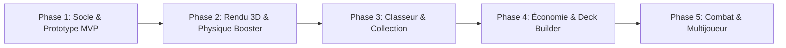

# ⚡ PokéTCG Web Simulator & Collection Experience

> **Une expérience web immersive et ultra-réaliste dédiée à la collection et au jeu Pokémon TCG.**  
> Ouvrez des boosters comme dans la vraie vie, admirez les reflets holographiques en 3D, organisez votre classeur de cartes officiel et construisez vos decks.

---

## 📌 Présentation du Projet

Le projet a pour ambition de recréer les sensations physiques et visuelles de l'univers des cartes à collectionner Pokémon (**Pokémon Trading Card Game**) directement dans le navigateur :
- **Ouverture de boosters physique et interactive** : froissement de l'emballage, découpe/déchirure du paquet, manipulation carte par carte avec le rituel classique du *card trick* (dévoiler l'énergie et garder l'ultra-rare pour la fin).
- **Rendu visuel fidèle et effets holographiques dynamiques** : reproduction des textures (Reverse Holo, Full Art, Illustration Rare, Gold, Textured) réagissant aux mouvements de la souris ou au gyroscope mobile.
- **Bibliothèque et classeur virtuel authentique** : inspection des cartes en haute définition, gestion des doublons, statistiques de complétion de séries et vue classeur (*binder*) réaliste.

---

## 🛠️ Stack Technique Retenue

### Frontend
- **Framework** : [React 19](https://react.dev/) + [TypeScript](https://www.typescriptlang.org/) — Performance, robustesse et typage strict des données de cartes.
- **Build Tool** : [Vite](https://vitejs.dev/) — Démarrage instantané et Hot Module Replacement (HMR) ultra-rapide.
- **Styling** : [Tailwind CSS v4](https://tailwindcss.com/) — Design moderne, fluide et responsive.
- **Composants UI** : [shadcn/ui](https://ui.shadcn.com/) / Radix UI — Composants accessibles et customisables pour les modales, menus et filtres.
- **Icônes** : [Lucide React](https://lucide.dev/) — Iconographie épurée et moderne.

### Rendu Visuel, Physique & Effets 3D
- **Animations d'interface** : [Framer Motion](https://www.framer.com/motion/) — Transitions fluides pour le flux d'ouverture, les menus et les interactions.
- **Shaders & Effets Holographiques 3D** : [Three.js](https://threejs.org/) / [@react-three/fiber](https://r3f.docs.pmnd.rs/) ou **CSS 3D Transforms + Shaders GLSL / Canvas** — Simulation d'iridescence, reflets de lumière, textures foil et inclinaison dynamique (*tilt effect*).
- **Physique du booster** : Canvas / Matter.js ou gestes tactiles avec [use-gesture](https://use-gesture.netlify.app/) pour simuler la déchirure du paquet.

### Audio & Haptique
- **Moteur Audio** : [Howler.js](https://howlerjs.com/) — Spatialisation et synchronisation des bruitages haute fidélité (froissement de plastique métallique, déchirure, glissement de carte, tintement d'une carte rare).
- **Feedback Haptique** : Web Vibration API sur smartphones compatibles lors de la révélation des cartes rares.

### Gestion d'État & Persistance
- **State Management** : [Zustand](https://zustand.docs.pmnd.rs/) — Gestion d'état légère, modulaire et hautement réactive.
- **Base de Données Locale** : [IndexedDB](https://developer.mozilla.org/fr/docs/Web/API/IndexedDB_API) (via `idb` ou `Dexie.js`) — Stockage haute capacité pour la collection du joueur, l'historique des tirages et les caches d'images HD, avec options d'import/export JSON.

### Données & API Pokémon TCG
- **API Principale** : [Pokémon TCG API (pokemontcg.io)](https://pokemontcg.io/) — Base de données exhaustive des sets officiels (Écarlate et Violet, 151, Épée et Bouclier, etc.), visuels officiels HD, types, attaques et raretés.
- **Cache local / CDN** : Pré-génération de métadonnées légères pour garantir un chargement instantané sans latence réseau.

---

## 🌟 Fonctionnalités Principales & Idées Innovantes

### 1. Système d'Ouverture de Booster Réaliste
- **Sélection des extensions** : Choix de sets phares (*ex: 151, Flammes Obsidiennes, Forces Temporelles, Réjouissances Étincelantes*).
- **Gestuelle tactile / souris** : Tirer pour déchirer le haut du paquet, sortir le bloc de cartes.
- **Rituel du collectionneur** :
  - Option de "Card Trick" (placer les cartes communes devant pour garder le suspense).
  - Dévoilement progressif (*edge reveal*) pour reconnaître le contour foil avant la révélation complète.
- **Simulation exacte des ratios** : Respect des probabilités réelles de drop (Commune, Peu Commune, Rare Holo, Double Rare, Illustration Spéciale, Gold) et possibilité rare de tomber sur un *God Pack*.

### 2. Moteur Visuel de Cartes
- **Reflets foil selon la rareté** :
  - *Standard Holo* : Lignes verticales de brillance.
  - *Reverse Holo* : Brillance sur le fond de la carte et non l'illustration.
  - *Ultra / Secret Rare* : Effet arc-en-ciel cosmique + micro-textures granulées.
  - *Gold* : Brillance dorée métallique intense.
- **Mode Inspection 3D** : Zoom pleine page, rotation libre à 360°, simulation de source lumineuse qui se déplace avec la souris.

### 3. Bibliothèque & Classeur Virtuel (*Binder*)
- **Vue Classeur Réaliste** : Pages de 9 cartes (3x3) ou 12 cartes (4x3) avec pochettes transparentes, bruitages réalistes pour tourner les pages.
- **Organisation libre** : Glisser-déposer des cartes dans les pochettes du classeur.
- **Filtres Avancés** : Recherche par nom, rareté, type élémentaire, extension, illustrateur, PV, cartes possédées / manquantes.
- **Suivi de complétion** : Jauge de progression en % par extension et compteur de cartes uniques collectées.

### 4. Fonctionnalités Additionnelles & Gamification
- **Économie de jeu équilibrée** :
  - Boosters quotidiens offerts.
  - Pièces et Poussière d'Étoile gagnées en ouvrant des boosters pour acheter des paquets spécifiques.
- **Système de "Wonder Pick" (Pioche Miraculeuse)** : Choisir une carte au hasard parmi un booster ouvert par un autre joueur virtuel.
- **Deck Builder** : Concepteur de deck standard (60 cartes) avec vérification de validité et simulateur de main de départ.
- **Échange & Marché de cartes (Fictif)** : Système de recyclage des doublons contre des devises ou échange contre des cartes cibles.

---

## 🗺️ Roadmap de Développement



### 🧱 Phase 1 : Fondations & Prototype MVP
- [x] Initialisation du projet Vite + React + TypeScript + Tailwind CSS.
- [x] Modélisation des types de données (Carte, Booster, Extension, Rareté, Collection).
- [x] Intégration de l'API Pokémon TCG et mock local complet multi-extensions (171 cartes).
- [x] Composant de carte de base avec affichage recto/verso et flip animation.
- [x] Algorithme de génération de booster avec tirage pondéré selon les raretés réelles.
- [x] Interface immersive de tirage de cartes avec rituel de suspense (Card Trick).

### ✨ Phase 2 : Immersion Visuelle, Physique & Audio
- [x] Conception de l'effet 3D interactif avec réfraction holographique (shaders foil, grain cosmos, reflets or).
- [x] Animation réaliste de déchirure et déballage du booster (geste swipe/drag feutré).
- [x] Ajout des bruitages de manipulation haute fidélité (froissement, déchirement, carillons, fanfares).
- [x] Effets spéciaux lors de la découverte de cartes d'exception (effets de particules, vibration haptique).
- [x] Persistance locale de la collection du joueur avec IndexedDB et export JSON.

### 📖 Phase 3 : Bibliothèque & Classeur Virtuel (*Binder*)
- [x] Interface de bibliothèque avec recherche textuelle instantanée et filtres multi-critères.
- [x] Mode d'affichage "Classeur" interactif (pages tournantes 3x3, pochettes transparentes avec reflets, son de page).
- [x] Indicateurs de complétion par set et suivi des cartes manquantes.
- [x] Gestion des doublons et statistiques globales du joueur.
- [x] Système d'export et d'import de sauvegarde au format JSON.
- [x] Atelier de Recyclage des doublons & Forge de cartes (*Crafting*) via Poussière d'Étoile (*Stardust*).

### 🃏 Phase 4 : Deck Builder & Économie Virtuelle
- [ ] Créateur de decks (respect des règles officielles : 60 cartes, maximum 4 exemplaires, cartes Énergie).
- [ ] Simulateur de tirage de main initiale et test de probabilités de pioche.
- [x] Système de quêtes quotidiennes, recharges et boosters gratuits.
- [x] Système de conversion des doublons en devises virtuelles pour fabriquer (*craft*) des cartes précises.
- [ ] Fonctionnalité de *Wonder Pick* inspirée de Pokémon TCG Pocket.


### ⚔️ Phase 5 : Duel & Fonctionnalités Sociales
- [ ] Mode d'entraînement de combat simplifié contre une IA (calcul des dégâts, faiblesses, énergies).
- [ ] Système de partage de cartes et de decks via lien ou code QR.
- [ ] Matchmaking en ligne simplifié en peer-to-peer (WebRTC) ou WebSocket.

---

## 🚀 Guide de Démarrage (Développement futur)

### Prérequis
- [Node.js](https://nodejs.org/) (version 20 LTS ou supérieure recommandée)
- `npm`, `pnpm` ou `yarn`

### Installation
```bash
# Cloner le dépôt
git clone <URL_DU_REPO>

# Installer les dépendances
npm install

# Lancer le serveur de développement
npm run dev
```

---

## ⚖️ Mentions Légales
*Ce projet est un projet de fan à but éducatif et non commercial. Les visuels, noms et mécaniques de Pokémon et du Pokémon Trading Card Game sont la propriété exclusive de The Pokémon Company, Nintendo, Game Freak et Creatures Inc.*
